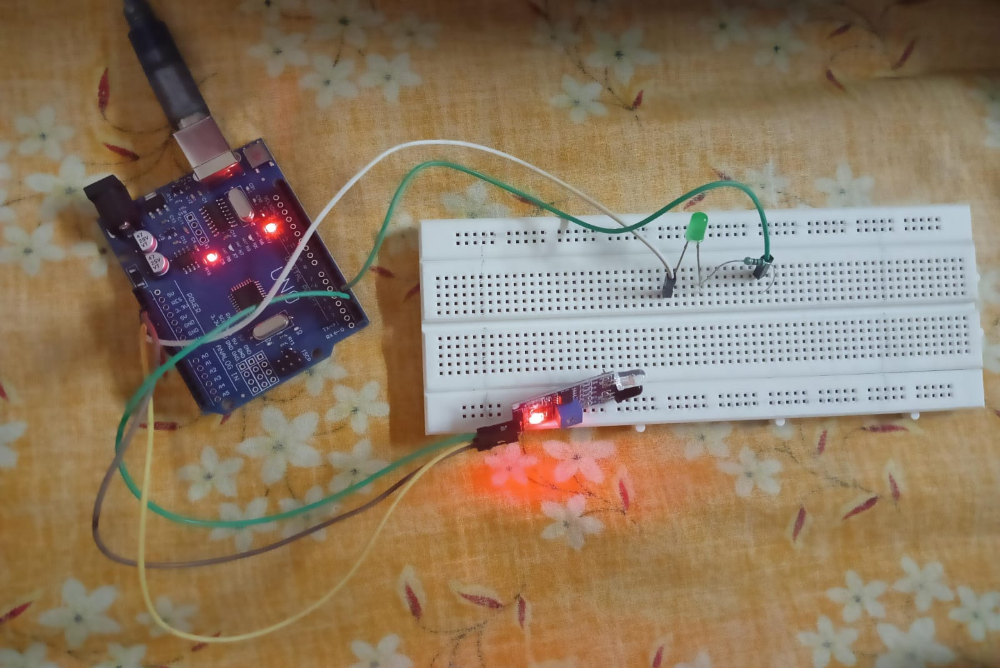
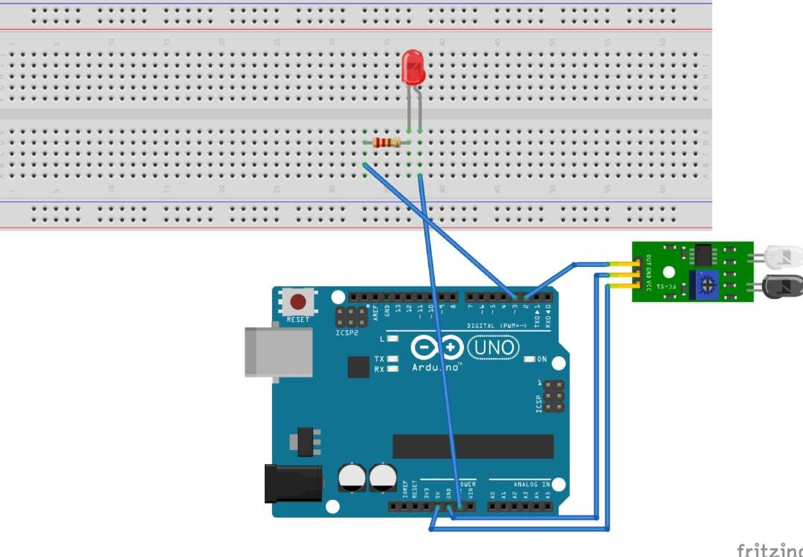

# IR Proximity Sensor using Arduino Uno

## 📌 Project Overview

This project demonstrates real-time object detection using an **IR (Infrared) Proximity Sensor** interfaced with an **Arduino Uno**. The system detects the presence of nearby objects without physical contact and provides visual feedback through an LED indicator.

The project introduces the fundamentals of sensor interfacing, object detection, and embedded system applications using Arduino.

---

## 🎯 Objectives

- To understand the working principle of an IR proximity sensor.
- To interface the IR sensor with Arduino Uno.
- To detect nearby objects in real time.
- To study basic sensing and automation applications using microcontrollers.

---

## 🛠️ Components Used

- Arduino Uno
- IR Proximity Sensor Module
- LED
- Resistor
- Jumper Wires
- USB Cable
- Arduino IDE

---

## 🔌 Circuit Connections

| Component | Arduino Uno Pin |
|------------|----------------|
| VCC | 5V |
| GND | GND |
| OUT | D2 |
| LED (+) | D3 |
| LED (-) | GND (through resistor) |

---

## 📷 Hardware Setup

*Figure 1: Hardware implementation of the IR proximity sensor system.*

---

## 🔧 Circuit Diagram

*Figure 2: Circuit diagram showing the interfacing between the IR proximity sensor and Arduino Uno.*

---

## 📽️ Project Demo

📹 [Watch the Project Demonstration on Google Drive](https://drive.google.com/file/d/1bzxHwdVecfeh7Z4J2Zq-vjy3P_nyEgKq/view?usp=drivesdk)

---

## 💻 Arduino Program

The Arduino code used in this project continuously reads the sensor output and controls the LED based on object detection. When an object is detected within the sensing range, the LED turns ON; otherwise, it remains OFF.

🔗 **Source Code:** [IR_Proximity_Sensor.ino](proximity.ino)

---

## ⚙️ Working Principle

The IR proximity sensor consists of an infrared transmitter and receiver. The transmitter emits infrared rays, which are reflected when they strike a nearby object.

The receiver detects the reflected infrared light and generates a corresponding output signal. The Arduino reads this signal and activates the LED whenever an object is detected within the sensor's range.

---

## 📈 Results

The system successfully detected nearby objects and provided real-time visual indication through the LED. The LED turned ON when an object entered the sensing range and turned OFF when the object moved away.

---

## 🚀 Applications

- Obstacle detection systems
- Automatic doors
- Line-following robots
- Industrial automation
- Smart security systems
- Touchless sensing applications

---

## 🔍 Key Learnings

- Interfacing sensors with Arduino Uno.
- Understanding IR-based object detection.
- Implementing real-time sensing systems.
- Gaining hands-on experience with embedded systems.

---

## 🚀 Future Enhancements

- Integration with IoT platforms for remote monitoring.
- Addition of buzzer or display alerts.
- Development of obstacle avoidance systems.
- Use of multiple sensors for wider coverage.

---

## 👩‍💻 Author

**Mampi Das**  
B.Tech in Electrical Engineering  
National Institute of Technology Agartala

The project was developed as part of academic learning and practical experimentation in sensor interfacing and embedded systems.
